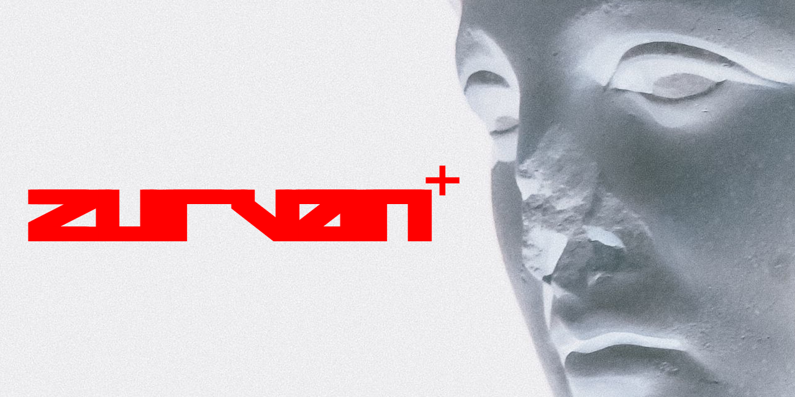

# ZURVAN (v1.0.0 Decentralized Clock Synchronization Engine)



An advanced, high-performance, completely dependency-free Clock Jitter Estimation and Microsecond Drift Reconciliation Engine written from scratch in pure C++17.

In mission-critical distributed systems—such as high-frequency financial ledgers, power grid distribution monitors, or mesh networking arrays—slight discrepancies in time execution kill consistency. Internal hardware clocks naturally drift by microseconds every minute due to temperature shifts and crystal oscillator aging. Standard NTP/PTP architectures freeze if central Stratum 1 servers or GPS signals drop offline or face tactical jamming.

ZURVAN solves this crisis by calculating, filtering, and correcting temporal clock desynchronization curves natively on the local CPU registers using zero-dependency statistical filters, establishing clock alignment across isolated nodes.

---

## 🔬 Core Subsystem Attributes

*   **Zero Dependency Core:** Compiled straight to bare-metal using only native C++ standard system headers (`<chrono>`, `<fstream>`, `<vector>`), guaranteeing zero runtime library bloat.
*   **Contiguous Telemetry Packing:** Groups time variables into dense, non-padded 25-byte `ClockSnapshot` frames, maximizing processor cache locality.
*   **Bare-Metal Scalar Kalman Filter:** Tracks real-time microsecond offset variances and filters out volatile network packet latency jitter "noise" without pulling in heavy matrix mathematics frameworks.
*   **Least-Squares Linear Regression:** Periodically parses historical snapshot tables in memory to derive the exact acceleration and velocity slope coefficient of localized hardware crystal clock drift.
*   **The Fontaine Architecture Alignment:** Unifies directly with **Purity-FS** (Sovereign Binary Storage), **ARABA** (Mesh Connectivity), **ATHENA** (State Serialization), and **POSEIDON** (Graph Router Network) to complete the master decentralized computing infrastructure pentalogy.

---

## 🛠️ Verification and Compilation Guide

### 📦 1. Clone the Complete Workspace Repository
```bash
git clone https://github.com/alistairfontaine/ZURVAN
cd ZURVAN
```

### 🔨 2. Execute the Automated Makefile Compiler Pass
```bash
make clean
make
```

### 🕹️ 3. Initialize the Interactive Calibration Console
```bash
./zurvan-vfs
```

---

## 💻 Native Terminal Prompt Command Reference

*   `sample <offset_us> <variance>` - Ingests a raw network offset timing handshake and updates the Kalman filter tracking registers.
*   `regression`                    - Computes the least-squares linear trend line slope across logs to isolate local clock crystal drift velocity.
*   `predict <duration_us>`         - Evaluates the derived drift slope to forecast the exact clock desynchronization offset position at a future horizon.
*   `view`                          - Prints out a detailed ledger list view of all cached snapshots in memory.
*   `save <file.zvn>`               - Serializes the active volatile RAM history data array directly to disk.
*   `load <file.zvn>`               - Ingests a raw .zvn container file off the storage partition and completely rebuilds table caches.
*   `exit / quit`                   - Safely releases descriptors and terminates the shell environment.

---

## 📂 Production Repository File Topology
*   `include/zurvan.hpp` - Packed data structure definitions, class methods, and private filter coefficients.
*   `include/shell.hpp`  - Interactive CLI controller configurations and stream maps.
*   `src/core/zurvan.cpp` - Scalar Kalman update pipelines and least-squares regression calculators.
*   `src/shell/shell.cpp` - Command token string parser loop logic and routing matrix.
*   `src/main.cpp`       - Execution setup entry point layer triggering standard input arrays.
*   `docs/`               - Comprehensive operational manuals, roadmap changelogs, and technical design manifestations.
*   `tests/`              - Isolated target test directory holding compiled localized `.zvn` virtual disk images.

---

## 📜 Open-Source Framework License
ZURVAN is fully open-source and free to distribute under the terms of the official MIT License contract structure.
